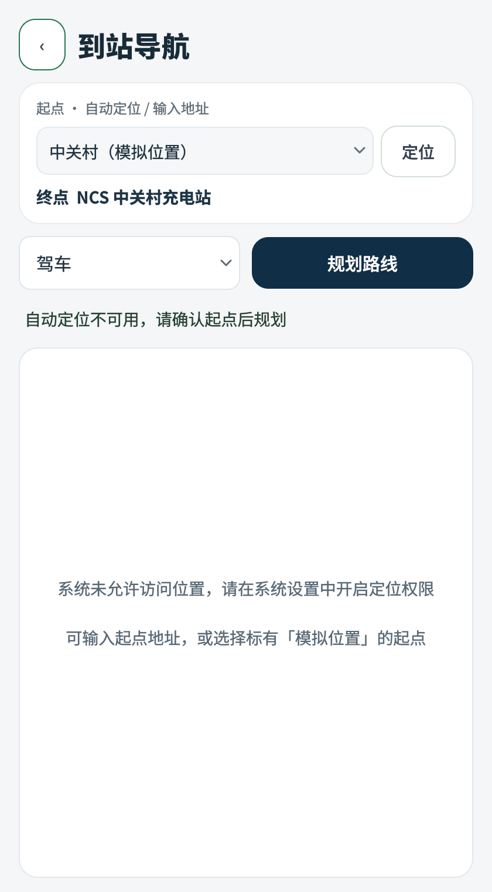
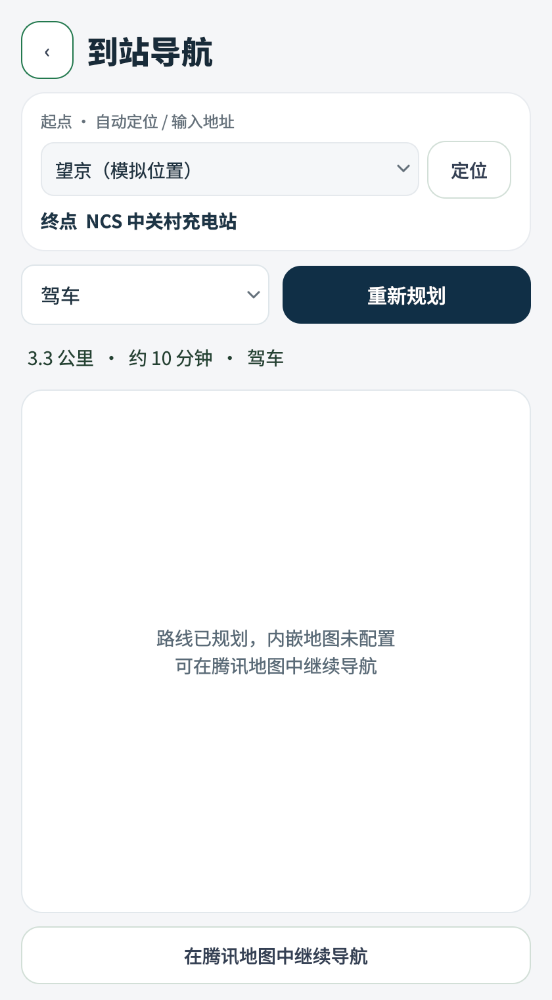
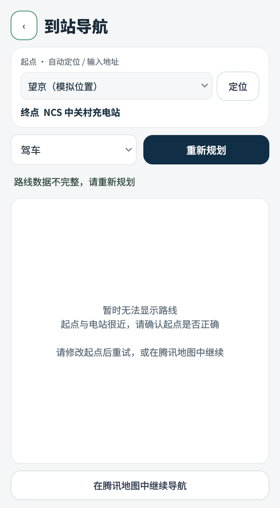

# 导航起点与界面修复验证（2026-09-07）

关联需求：UC-U-04。原问题是客户端把目标电站坐标作为起点，腾讯返回成功状态但只有 1 米、没有折线，页面随之隐藏地图。

## 变更

进入导航页先请求系统位置。可用且新鲜的定位结果标记为 WGS84，由服务端转换为腾讯 GCJ-02 坐标后规划；自动定位失败时保留可编辑起点，用户确认模拟位置或输入地址后再规划。服务端拒绝起终点过近和退化路线，客户端对空折线、组件缺失及地图加载失败给出明确提示。导航页采用与用户端一致的浅色卡片、深色标题和主按钮，并保留地图区域。

接口细节见 [数据库与 API 契约](database-api.md)，行为以 [UC-U-04](01-requirements-specification.md#uc-u-04-一键导航) 为准。

## 验证

- Qt 6.8.3 / GCC / 现有 build-ncs：ncs_user、ncs_server 与四个导航相关测试目标编译通过。
- CTest：ncs_navigation_service、ncs_tencent_route_planner、ncs_user_business_routes、ncs_user_navigation_origin、ncs_server_smoke、ncs_server_http_smoke、ncs_user_smoke，7/7 通过。
- 回归涵盖起点独立传递、自定义地址不夹带坐标、WGS84 转换及转换失败、三种出行方式、起终点相同或过近、空/单点/重复/越界折线与 1 米退化响应。
- Qt 420×760 窗口，2 倍像素截图：定位失败后确认起点、选择模拟起点、有效路线摘要、退化路线明确提示通过。有效路线摘要使用受控响应验证，未使用真实腾讯 Key；不是本轮真实道路验收证据。
- 单独编译未定义 NCS_HAS_POSITIONING 的定位源码及未定义 NCS_HAS_WEBENGINE 的导航源码通过。
- scripts/check.sh 与 git diff --check 通过。

本机 CMake 3.22.1 低于仓库正式工具链要求，使用现有 build-ncs 验证，未降低正式工具链基线。VM GeoClue 返回该用户定位被禁用，无法在此环境证明自动定位成功后的整条真实地图链路；本次未更改系统定位权限或重启正在运行的服务。完成实机验收前，需求矩阵对应新增定位行为保持进行中。

## 页面证据

定位失败后，起点来源和下一步操作保持可见：

有效路线摘要与缺少 JS Key 的明确状态（受控响应）：

成功状态但空折线时，不静默隐藏地图：

